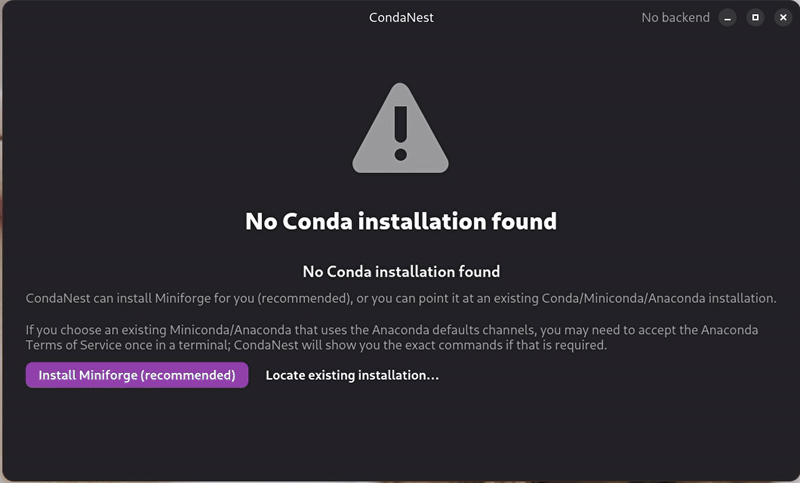

<p align="center">
  
</p>

## CondaNest: GUI Manager for Conda

A fast, minimal desktop app for **managing and cleaning Conda/Mamba environments** on Linux, Windows, and macOS.

**Default frontend:** Qt (PySide6) - works on all platforms  
**Alternative frontends:** GTK4 (Linux only) or Web (all platforms)   

<p align="center">
  
</p>


### Features

* List environments with path and disk usage
* Clone, rename, delete, export to `environment.yml`
* Bulk export or create envs from YAML folders
* Run `conda clean --all` from a simple dialog
* Manage global channels and strict priority
* Install packages in a environment

### Quick start (development)

```bash
git clone https://github.com/aradar46/condanest.git
cd condanest
python3 -m venv .venv
source .venv/bin/activate  # On Windows: .venv\Scripts\activate
pip install -e .
condanest  # Runs Qt frontend (default, cross-platform)
```

**Alternative frontends:**
```bash
condanest-gtk  # GTK4 frontend (Linux only)
condanest-web  # Web frontend (opens in browser)
```

### AppImage

```bash
chmod +x CondaNest-x86_64.AppImage
./CondaNest-x86_64.AppImage
```

### Anaconda Terms of Service

If you use **Anaconda or Miniconda** with default Anaconda channels, you may need to accept the Terms of Service once:

```bash
conda tos accept --override-channels --channel https://repo.anaconda.com/pkgs/main
conda tos accept --override-channels --channel https://repo.anaconda.com/pkgs/r
```

After running these commands, retry the operation in CondaNest.

### Requirements

**Default Qt frontend (cross-platform):**
* Python 3.10+
* PySide6 (installed automatically via pip)

**GTK4 frontend (Linux only):**
* Linux with GTK4 and Libadwaita
* `python3-gi`, `gir1.2-gtk-4.0`, `gir1.2-adw-1`

**Web frontend:**
* Python 3.10+
* FastAPI and Uvicorn (installed automatically via pip)

### License

MIT License
